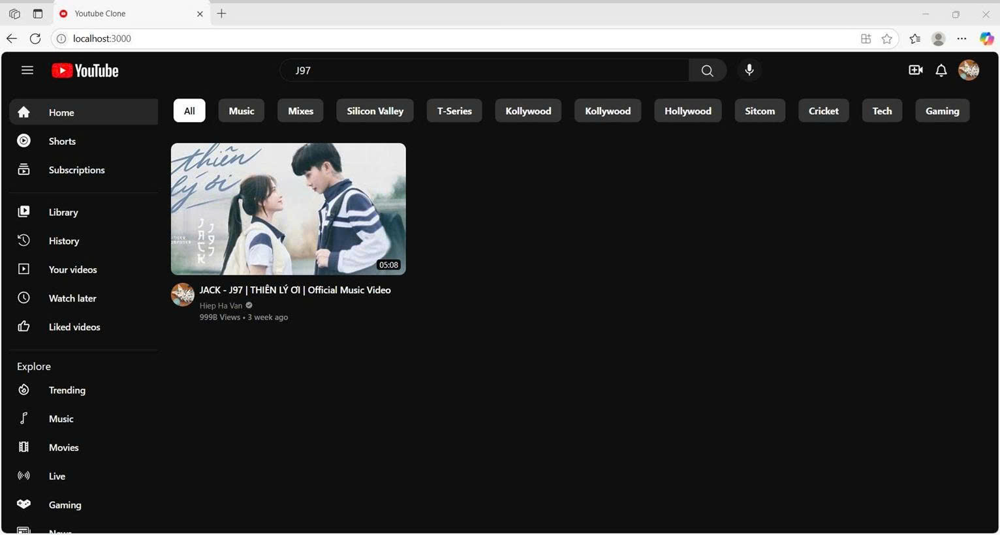

# Thành viên trong nhóm:
Nguyễn Bá Huy  23010806\
Hà Văn Hiệp    23010104\
Mai Đức Mạnh 23010814
#  YouTube Clone

Dự án này là một bản sao giao diện của YouTube, được xây dựng bằng ReactJS và sử dụng RapidAPI để tìm nạp dữ liệu video và kênh. Đây là một dự án front-end thể hiện khả năng sử dụng API, routing, component hóa trong React, và responsive UI.

##  Công nghệ sử dụng

- **React JS** – Framework chính cho giao diện người dùng.
-  **React Router DOM** – Quản lý điều hướng giữa các trang.
-  **Tailwind CSS** – Tạo giao diện hiện đại, responsive và dễ tùy biến.
-  **RapidAPI (YouTube v3 API)** – Nguồn dữ liệu video, kênh, tìm kiếm.
-  **Axios** – Gửi yêu cầu HTTP để lấy dữ liệu từ API.

##  Tính năng

- Tìm kiếm video theo từ khóa.
- Xem danh sách video theo chủ đề hoặc kênh.
- Phát video trực tiếp trong ứng dụng.
- Xem thông tin chi tiết của video và kênh.
- Giao diện responsive (hoạt động tốt trên mobile và desktop).

##  Giao diện người dùng

Trang chủ hiển thị danh sách video phổ biến và sidebar với các chủ đề:


Trang phát video:


Trang kết quả tìm kiếm:




##  Cách chạy dự án

### 1. Clone repository

```bash
git clone https://github.com/16yuji/superclone.git
cd superclone
```

### 2. Cài đặt dependencies

```bash
npm install
```


### 3. Chạy ứng dụng

```bash
npm start
```

Ứng dụng sẽ chạy tại `http://localhost:3000`

##  Kiến thức học được

- Cách làm việc với API trong React.
- Cấu trúc một ứng dụng React chuyên nghiệp.
- Responsive UI với Tailwind CSS.
- Xử lý routing động trong SPA.

##  Ghi chú

- Ứng dụng này chỉ là bản **clone UI** của YouTube,  hỗ trợ chức năng như đăng nhập, upload clone từ ytb, bình luận...
- Hạn mức API miễn phí có thể giới hạn số lần tìm nạp dữ liệu.
##  video demo:
[🎬 Xem video demo trên ]([https://www.youtube.com/watch?v=YOUR_VIDEO_ID](https://drive.google.com/drive/folders/1bew3X5V1ZE2wIlP9YDew-ixJtQRAEy9e))


